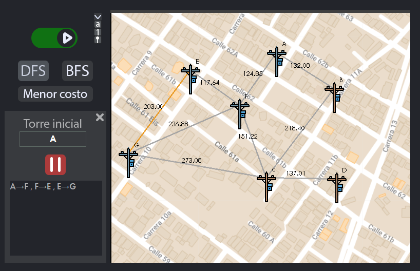

# Grapher
Visual graphs DFS, BFS, Kruskal algorithms

Grapher is a project that allows visualizing and traversing graphs using towers and cables to represent nodes and edges. This project is developed in Java with Java Swing and utilizes the DFS (Depth-First Search) and BFS (Breadth-First Search) algorithms, as well as the Kruskal's algorithm to find the shortest path that connects all nodes.

## Features

- Interactive visualization of graphs using graphical representation with towers and cables.
- Implementation of DFS and BFS algorithms for graph traversal.
- Utilization of Kruskal's algorithm to find the shortest path.
- Intuitive graphical interface to interact with graphs and execute algorithms.

## Screenshots

Here are some screenshots that illustrate the interface and algorithms in action:

*DFS (Depth-First Search) traversal on the graph.*

*BFS (Breadth-First Search) traversal on the graph.*

*Shortest path found using Kruskal's algorithm.*

## System Requirements

- Java (version 1.8.0_241)

## How to Use

1. Clone this repository: `git clone https://github.com/salo368/Grapher.git`
2. Open the project in your preferred Java development environment.
3. Compile and run the program.
4. Interact with the graphical interface to add nodes and edges, execute traversal algorithms, and find the shortest path.

---

Thank you for your interest in the Grapher project! If you have any questions or need further information, feel free to contact me.

